# This is my code for a failure-inducing input for the buggy program, as a JUnit test and any associated code

## This is the code:

```
  static void reverseInPlace(int[] arr) {
    for(int i = 0; i < arr.length; i += 1) {
      arr[i] = arr[arr.length - i - 1];
    }
```
## And the failure-inducing JUnit test

```
@Test 
	public void testFiveInPlace() {
    int[] input1 = {1,2,3,4,5};
    ArrayExamples.reverseInPlace(input1);
    assertArrayEquals(new int[]{5,4,3,2,1}, input1);
	}
```

# This is my code for an input that doesn’t induce a failure, as a JUnit test and any associated code 

## This is the code

```
  static void reverseInPlace(int[] arr) {
    for(int i = 0; i < arr.length; i += 1) {
      arr[i] = arr[arr.length - i - 1];
    }
  }
```

## And the test that doesnt fail:

```
  @Test 
	public void testOneInPlace() {
    int[] input1 = {1};
    ArrayExamples.reverseInPlace(input1);
    assertArrayEquals(new int[]{1}, input1);
	}
```

# These are the two resutls I got:

## Fail inducing test:

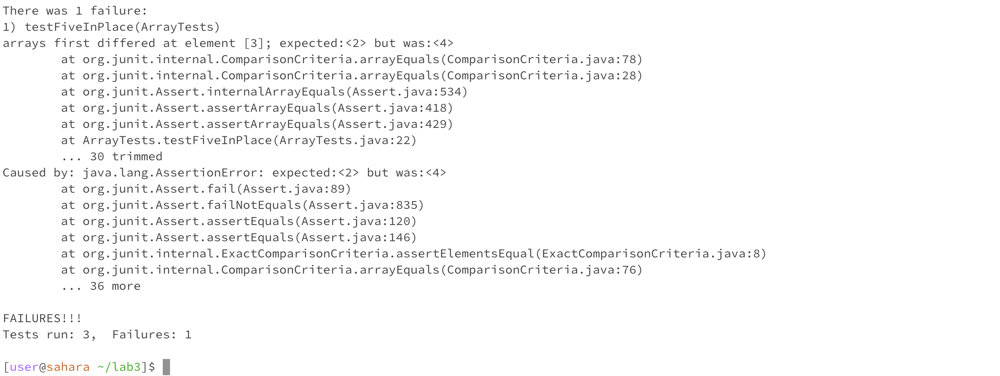

# No Fail inducing test:

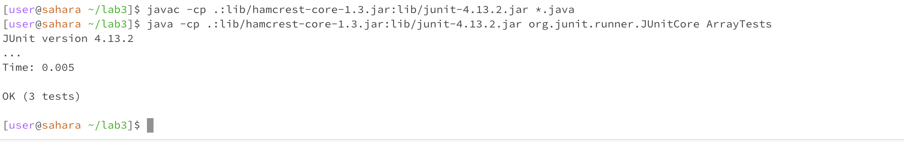

# This is the code before:

```
  static void reverseInPlace(int[] arr) {
    for(int i = 0; i < arr.length; i += 1) {
      arr[i] = arr[arr.length - i - 1];
    }
  }
```

# This is the code after:

```
  static void reverseInPlace(int[] arr) {
    for(int i = 0; i < arr.length / 2; i += 1) {
      int temp = arr[i];
      arr[i] = arr[arr.length - i - 1];
      arr[arr.length i - 1] = temp;
    }
  }

```

> This code fixes the reverseInPlace because it swaps the elemts at position i and arr.length - i - 1 and stores it in a temporary variable. This ensures that every element is only moved once so it is reversed. The code beofre makes it so that once you swap past the middle the array will start swapping elements back that have already been modified so for example if i is the last element in the array, the first element which has the value of the last element will be assigned to the last element aswell.

# Here are the list of modifications ChatGPT gave me that I can use for grep:

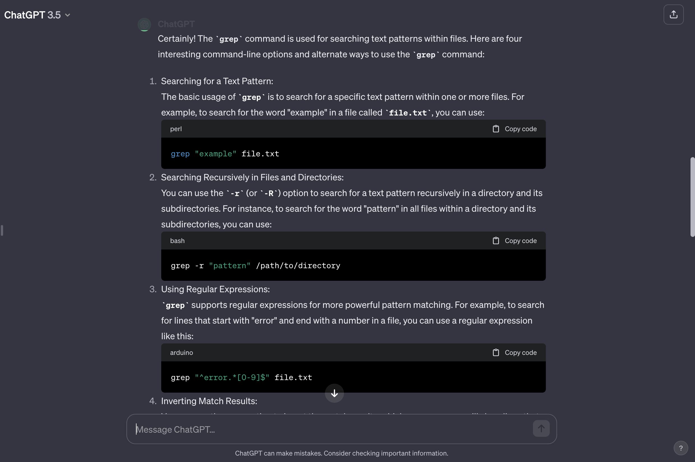

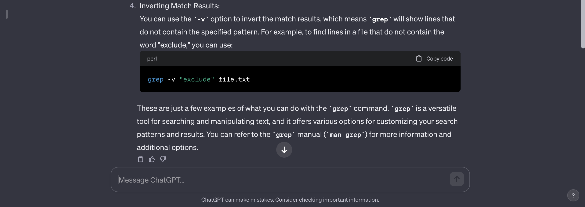

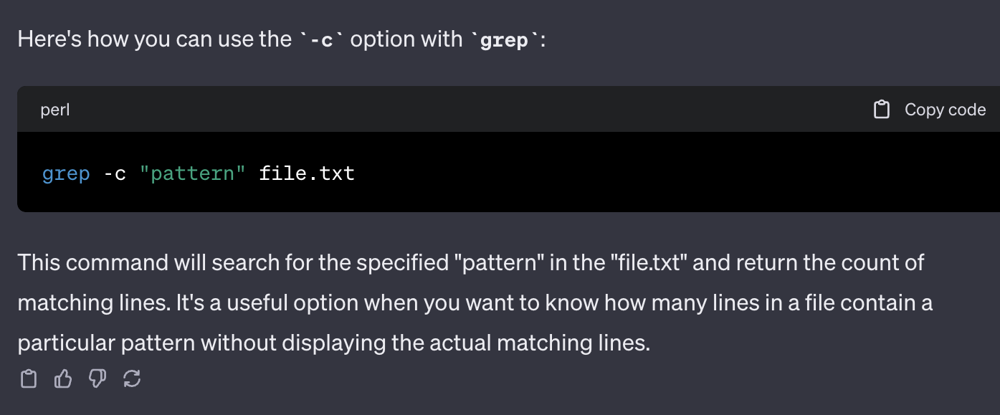

> I used 3 different commands, grep -r,grep -c,grep -v and also used a word to search for a pattern


## This is what I did for grep -r

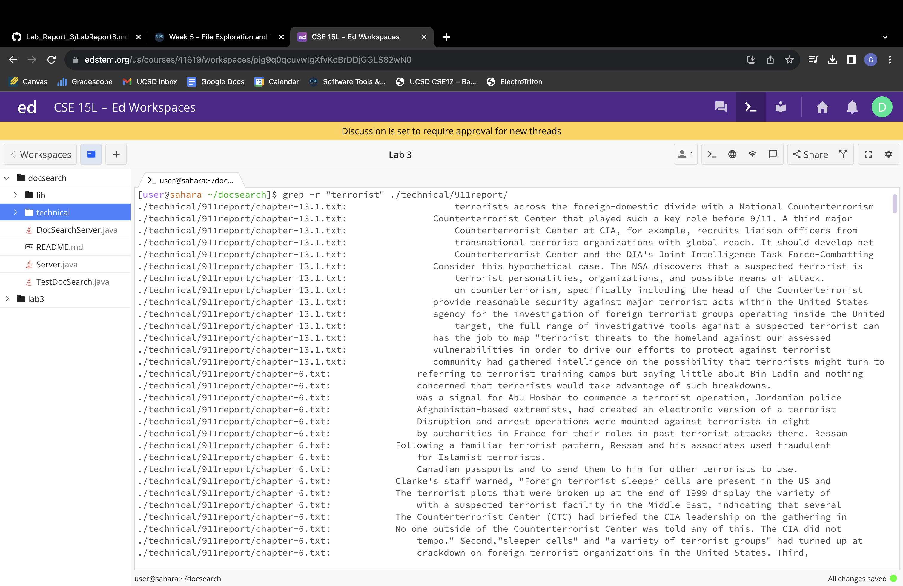

> This command will search all the files in 911report directory and print each line that contains the specified word

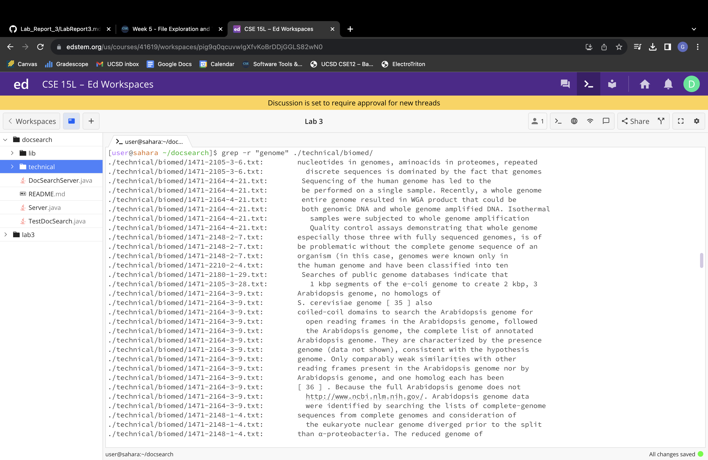

> This command will search all the files in biomed directory and print each line that contains the specified word

## This is what I did for grep -c 


> This command will count all the lines that contains the specified word in a specific file in 911report

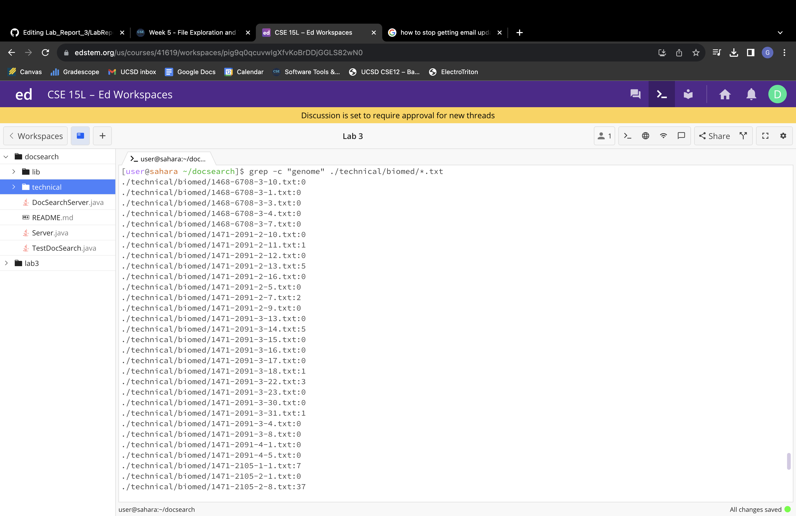

> This command will go over all the files in biomed and count all the lines that contains the specified word for each file in biomed

## This is what I did for grep -v

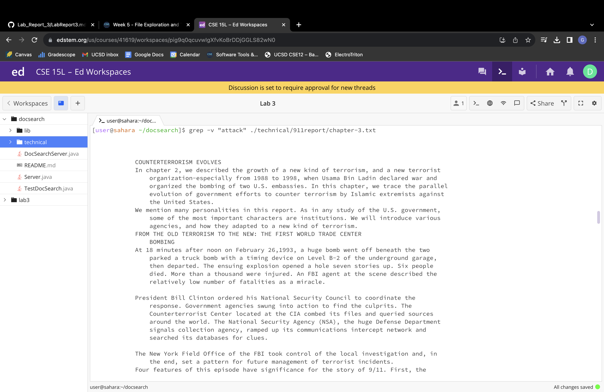

> This command will display every line that does not include the specified word in it in a specific file.

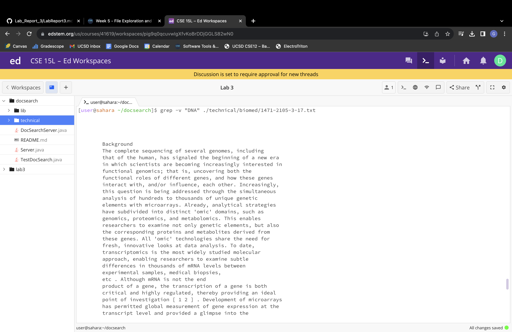

> This command will display every line that does not include the specified word in it in a specific file.

## This is what I did to find a text pattern in a file with grep


> This command will search the occurance of the word "flight" in the specified file.

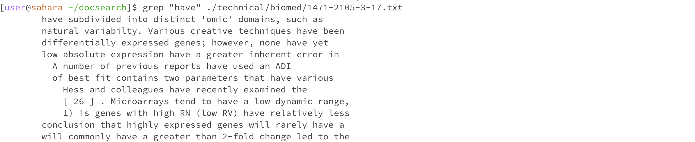

> This command will search the occurance of the word "have" in the specified file.


